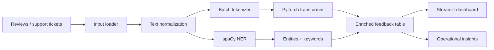

# NLP-Based Insights from Unstructured Customer Feedback

An end-to-end portfolio project that turns reviews and support tickets into sentiment, entities, topics, and operational insights. The project is designed as a production-minded baseline for customer experience analytics: reproducible preprocessing, batched PyTorch inference, explainable entity extraction, and an interactive Streamlit surface.

## Day 1 scope

- Canonical input contract for CSV, TSV, JSON, and TXT feedback.
- Batched Hugging Face transformer sentiment inference with GPU auto-detection.
- spaCy NER with a deterministic regex fallback for environments without the model download.
- Lightweight keyword extraction for an interpretable baseline.
- Sample data and CLI scripts ready for the Day 2 Streamlit dashboard.

## Architecture



## Setup

```bash
python -m venv .venv
# Windows PowerShell
.\.venv\Scripts\Activate.ps1
pip install -r requirements.txt
python -m spacy download en_core_web_sm
```

On Windows PowerShell, the repeatable setup path is `Set-ExecutionPolicy -Scope Process Bypass; .\setup.ps1`. The script checks for Python, creates the project-local environment, installs dependencies, and downloads the spaCy model.

The transformer model is downloaded on first use. For a public dataset, use a Kaggle Amazon Reviews or Customer Support Tweets export, then point the scripts at the file. The only required field is a text column named `text`; common aliases such as `review`, `content`, `body`, and `ticket` are also detected.

## Run Day 1 pipeline

```bash
python scripts/prepare_dataset.py data/sample/customer_feedback.csv
python scripts/run_batch.py data/sample/customer_feedback.csv
```

The default model is `distilbert-base-uncased-finetuned-sst-2-english`, selected for a strong speed/quality trade-off in a portfolio demo. For a production extension, fine-tune a domain model on labelled support outcomes and calibrate confidence against a validation set.

## Dataset strategy

Start with the included synthetic sample to validate the engineering path. For a hiring-manager-ready evaluation, combine a public review dataset with a small manually labelled support-ticket set. Track source, product area, timestamp, and resolution outcome so insights can be tied to business action rather than presented as generic sentiment charts. Keep a time-based holdout to avoid leakage when measuring drift.

## Day 2 deliverables

- `app.py` with Batch Processor and Live Playground tabs.
- Plotly sentiment dashboard, executive readout, enriched table, and safe HTML entity highlighting in the live playground.
- `src/evaluation.py` and `scripts/evaluate.py` for accuracy, macro-F1, confusion matrix, and classification report output.
- `notebooks/01_day1_pipeline.ipynb` for a reproducible walkthrough.
- `Dockerfile`, `.streamlit/config.toml`, and a deployment-ready `requirements.txt`.

## Deploy publicly

The easiest public route is Streamlit Community Cloud:

1. Push this repository to GitHub.
2. Open Streamlit Community Cloud and choose **New app**.
3. Select `varshabalaji18/nlp-customer-feedback-insights`, branch `main`, and file `app.py`.
4. Deploy. The first run downloads the public Hugging Face sentiment model and the spaCy model.

For Docker-compatible hosts, build and run:

```bash
docker build -t feedback-intelligence .
docker run -p 8501:8501 feedback-intelligence
```

Live app: https://nlp-customer-feedback-insights-ee2563wnvovmgzsdbsycrv.streamlit.app/

